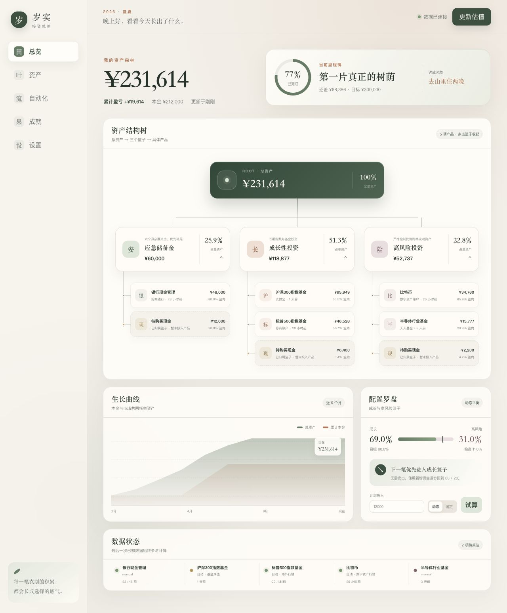
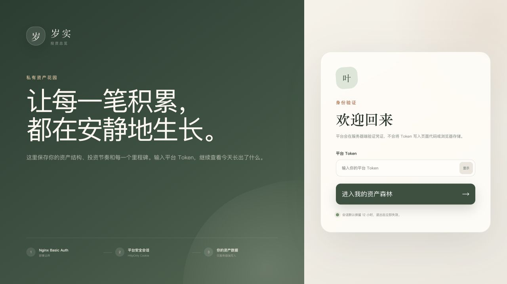
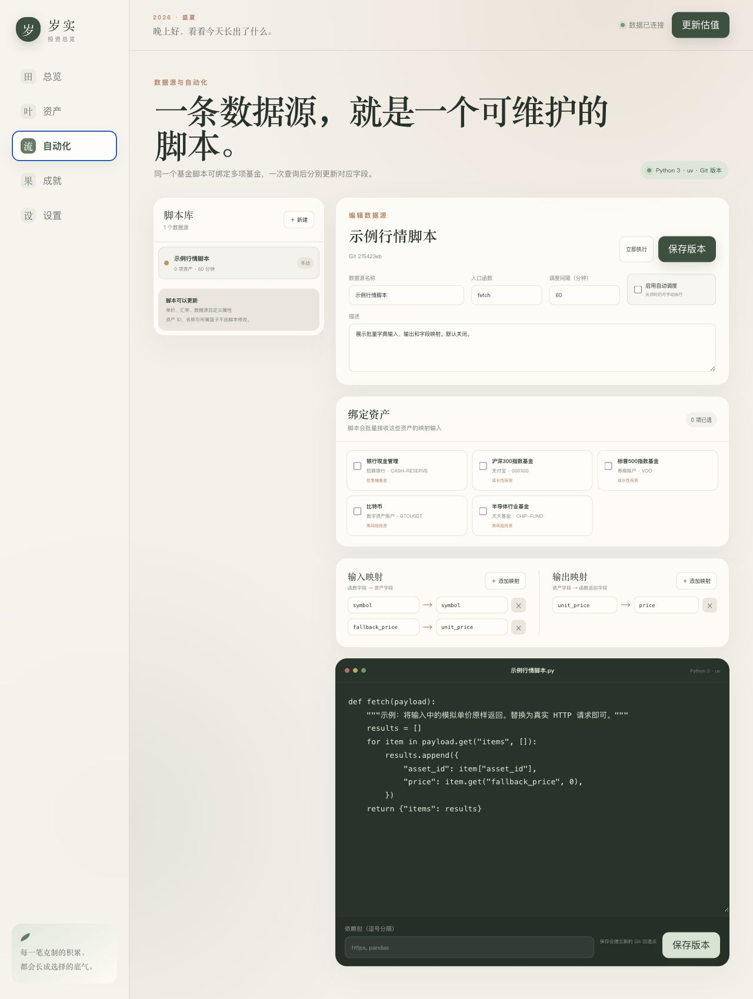
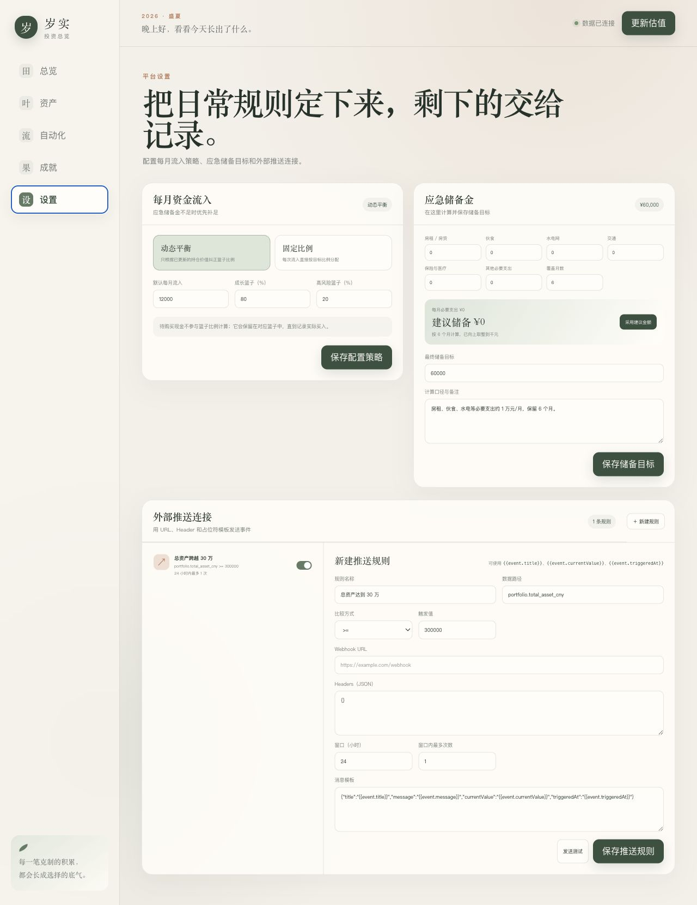
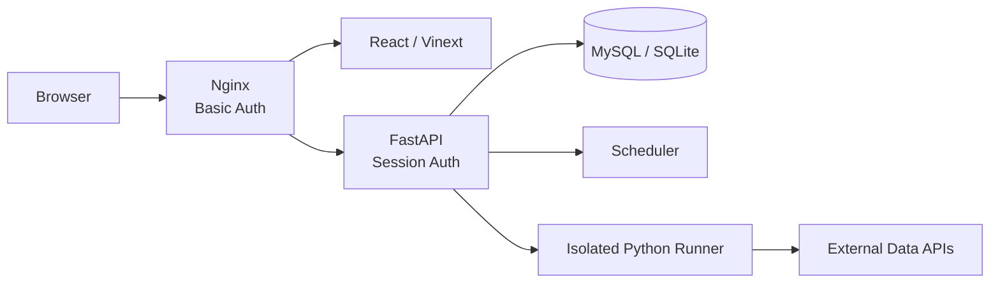

<div align="center">

# 岁实 · 投资总览

**把每一笔克制的积累，长成选择的底气。**

一个面向个人、可自托管的投资资产记录与成长展示平台。

`React 19` · `TypeScript` · `FastAPI` · `SQLAlchemy` · `MySQL / SQLite` · `Python Runner` · `Docker`

</div>



> [!NOTE]
> 截图中的金额、资产和平台均为匿名演示数据。本项目用于记录与展示，不提供投资建议，也不执行交易。

## 为什么做岁实

普通记账工具能告诉你“有多少钱”，却很难回答更具体的问题：

- 应急储备金还差多少？
- 成长投资与高风险投资是否偏离了目标比例？
- 下一笔新资金应该怎样分配？
- 哪些数据已经很久没有更新？
- 距离下一个人生里程碑还有多远？

岁实将这些问题放进同一套资产流水、估值历史和可解释的配置规则中。

## 核心能力

| 能力 | 说明 |
| --- | --- |
| 🌳 计算机资产树 | 从总资产根节点展开三个篮子与具体产品，同时展示金额和比例 |
| 🧺 固定三篮子 | 应急储备金、成长性投资、高风险投资 |
| ⚖️ 动态/固定分配 | 应急储备优先；之后可纠正当前比例，也可按固定比例流入 |
| 📒 追加式历史 | 估值、资金流水和快照保留历史；业务数据只软删除 |
| 🛠️ Python 数据源 | 一条数据源对应一个可编辑脚本，支持批量资产绑定和输入/输出字段映射 |
| 📡 Webhook 推送 | 自定义 URL、Header、占位符模板以及“时间窗口内最多 N 次”限频 |
| 🏆 里程碑与成就 | 显示距离总资产目标的进度，保留达成时间与奖励展示 |
| 🔐 两层防护 | 部署层 Nginx Basic Auth + 平台层 HttpOnly 会话，凭证不写入前端代码 |

## 页面预览

### 服务器端安全会话



Token 只用于向后端换取签名会话；前端构建产物、`localStorage` 和 `sessionStorage` 都不保存凭证。

<table>
  <tr>
    <td width="50%"></td>
    <td width="50%"></td>
  </tr>
  <tr>
    <td align="center"><strong>数据源脚本库</strong></td>
    <td align="center"><strong>分配、应急储备与外部推送</strong></td>
  </tr>
</table>

## 系统结构



后端是唯一可写入业务数据库的服务。Python Runner 不拥有数据库凭证，只接收映射后的字典并返回字典。

## 快速开始

### Docker Compose

```bash
cp .env.example .env
docker compose up --build
```

启动后访问 <http://localhost:8080>。默认端口只绑定 `127.0.0.1`，默认凭证也只用于本机开发；用于真实资产前，请先修改 `.env` 中的所有凭证。

### 本地分服务开发

请参考 [开发文档](./docs/DEVELOPMENT.md)。完整测试：

```bash
./scripts/test-all.sh
```

## 自定义 Python 数据源

函数默认接收包含多项资产的字典，并使用稳定的 `asset_id` 返回结果：

```python
def fetch(payload):
    results = []
    for item in payload.get("items", []):
        results.append({
            "asset_id": item["asset_id"],
            "price": query_price(item["fund_code"]),
        })
    return {"items": results}
```

数据源运行在独立 Runner 中，依赖由 `uv` 管理。脚本只能更新单价、汇率和 `source_attributes` 中的扩展字段。

## 数据与安全

- 不要将 `.env`、数据库、备份、真实资产导出、Webhook 凭证或个人数据源脚本提交到 Git。
- 网络部署建议使用 HTTPS，并确保只有 Nginx 对外开放；后端和 Runner 不应直接暴露。
- 登录会话使用 `HttpOnly` Cookie；平台 Token 不应嵌入浏览器构建产物。
- 执行任意 Python 代码始终具有风险。请只运行自己编写或已审查的脚本，并将 Runner 与宿主机和业务数据库隔离。
- 公开源代码不等于公开个人实例。真实数据应当始终保持私有。

更完整的边界见 [产品规格](./PRODUCT_SPEC.md) 和 [架构设计](./docs/ARCHITECTURE.md)。

## 项目状态

当前为可本地运行的 MVP，核心资产、配置、数据源、快照和推送链路已实现。后续重点包括流水管理界面、里程碑编辑、脚本运行日志与数据库恢复演练。

## 许可协议

本项目采用 [GNU Affero General Public License v3.0](./LICENSE)，SPDX 标识为 `AGPL-3.0-only`。

AGPL-3.0 允许个人和商业使用，但修改后的版本一旦发布，或作为网络服务向用户提供，就必须按协议向相应用户提供完整对应源码。它不会禁止商业化；如你的目标是禁止一切商业使用，需要改用非 OSI 开源的源码可见协议。
